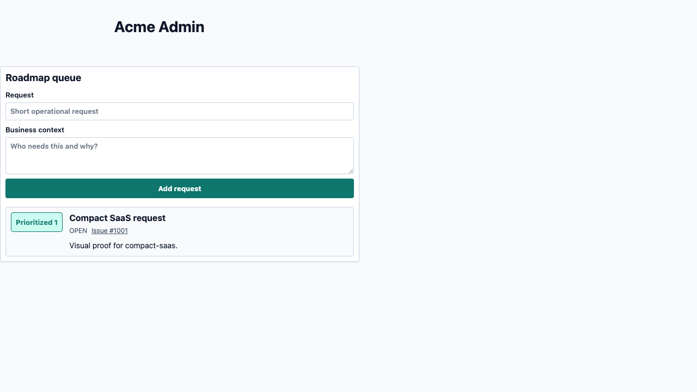
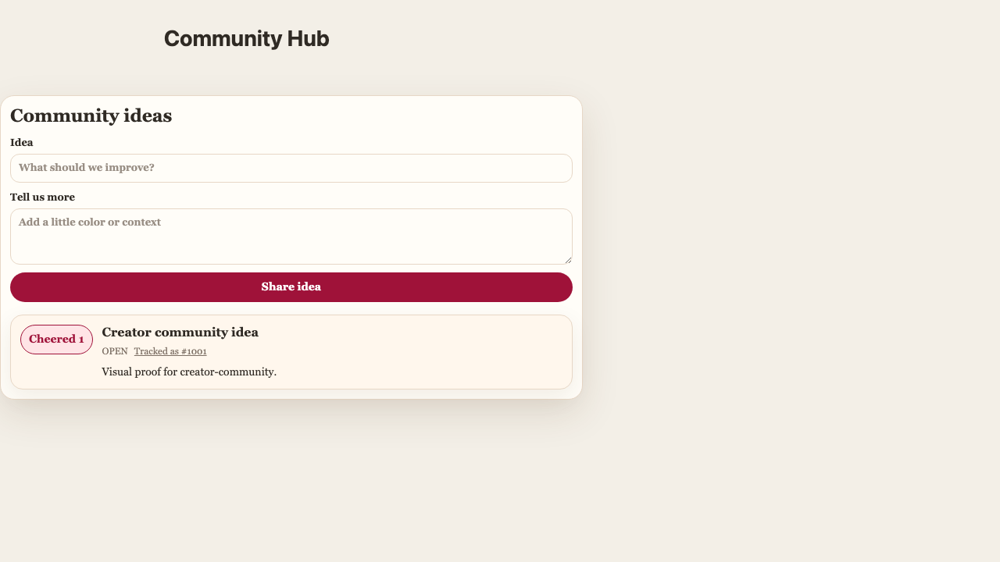
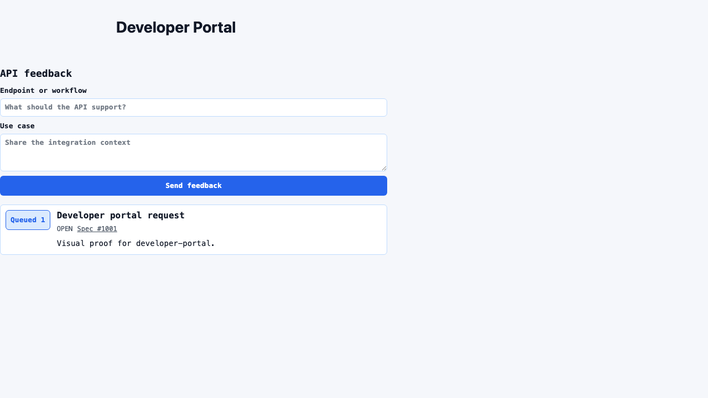
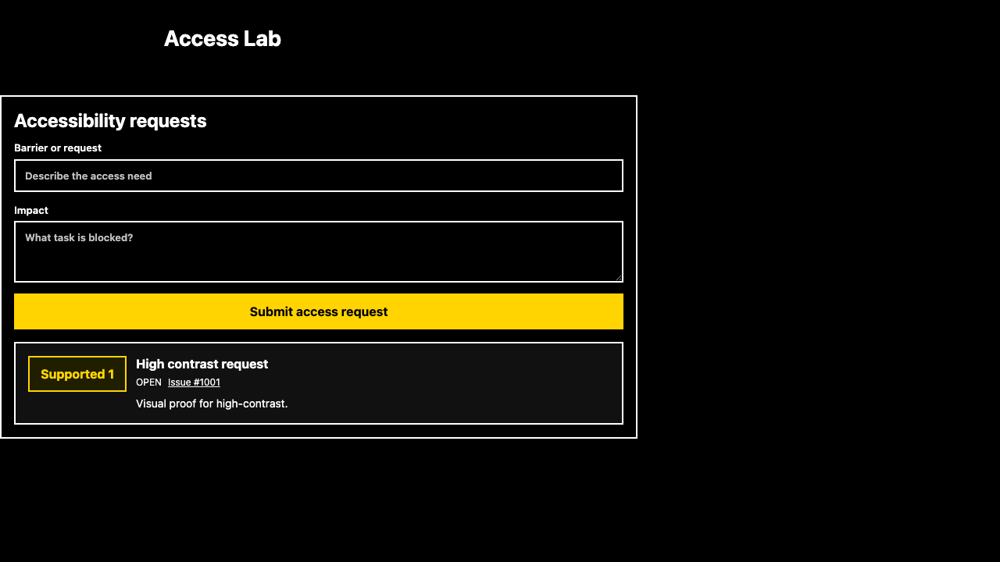
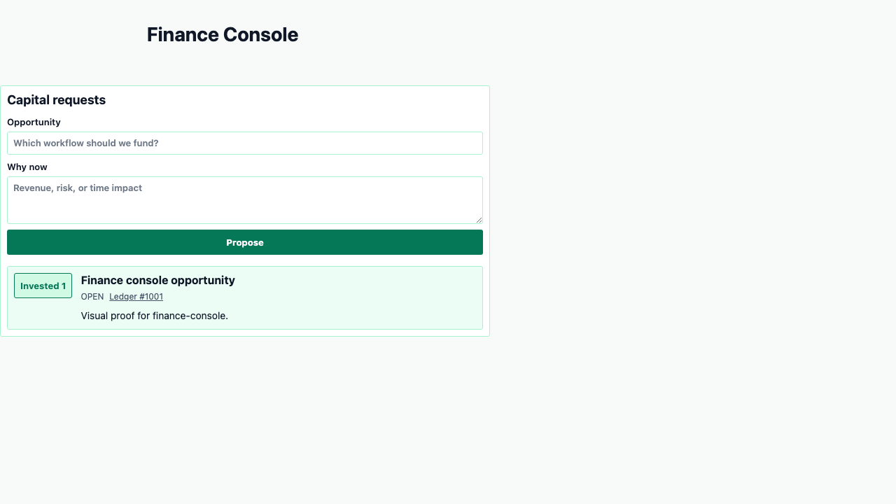
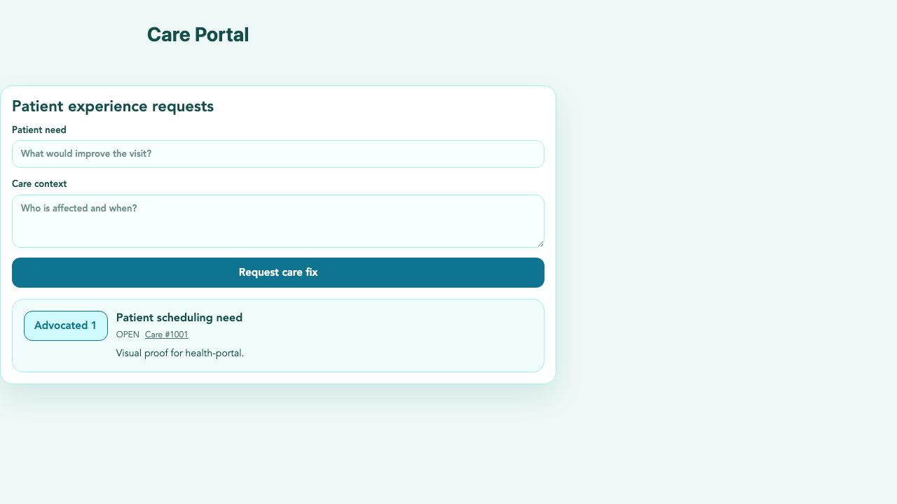
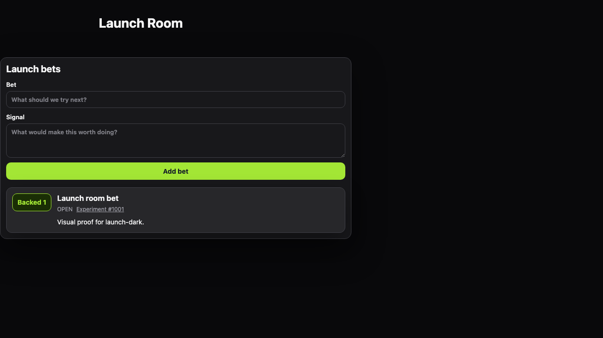
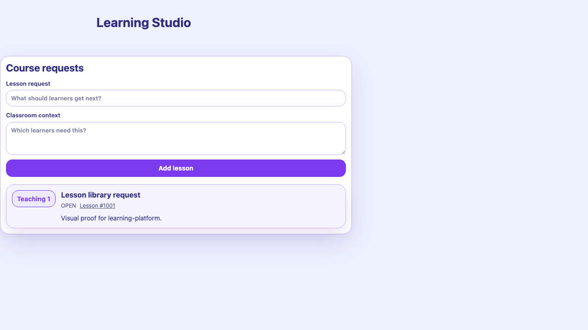
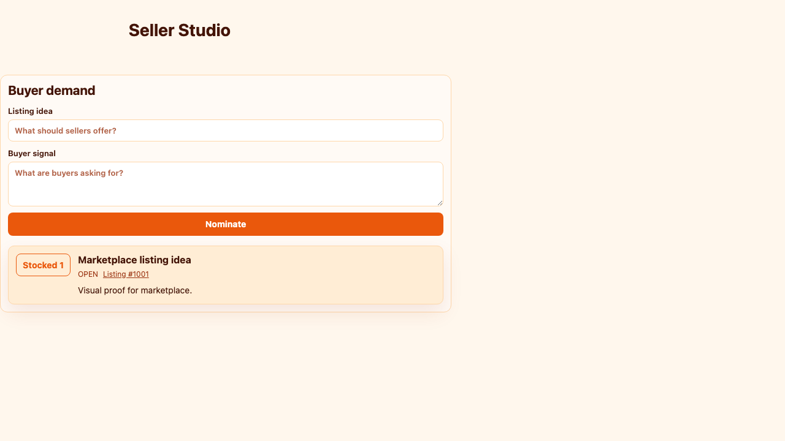
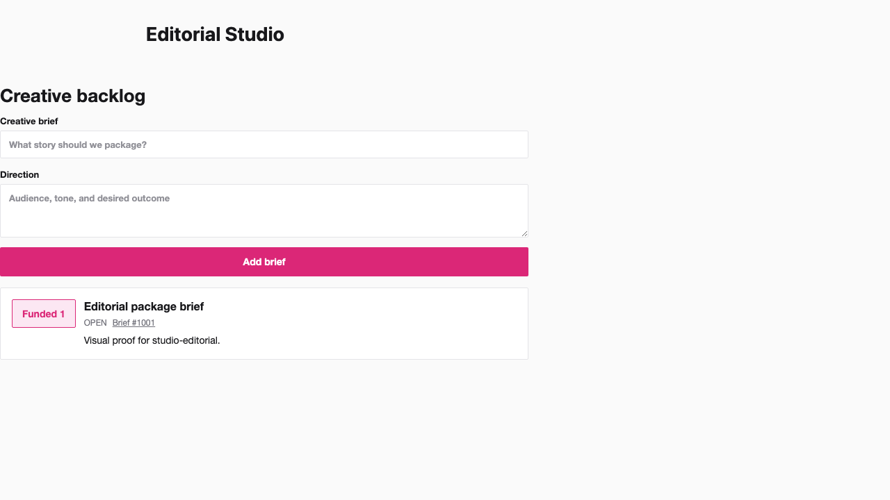

# Custom UX Examples

These examples are marketing-ready proof that BugDrop Board can adapt to several host-app
aesthetics without forking the widget. Each screenshot is captured from the real embedded widget,
using the same JSON customization contract documented in the README.

The examples are deliberately varied:

- compact SaaS admin;
- creator/community space;
- developer portal;
- finance console;
- healthcare portal;
- high-contrast accessibility board;
- dark launch-planning room;
- learning platform;
- marketplace seller studio;
- editorial/product studio.

Regenerate the screenshots after widget styling changes:

```sh
npm run capture:marketing-examples
```

## Compact SaaS



```json
{
  "layout": "panel",
  "density": "compact",
  "copy": {
    "heading": "Roadmap queue",
    "submitLabel": "Add request",
    "upvoteLabel": "Prioritize",
    "upvotedLabel": "Prioritized"
  },
  "theme": {
    "accent": "#0f766e",
    "accentSoft": "#ccfbf1",
    "border": "#cbd5e1",
    "buttonRadius": "4px",
    "fieldRadius": "4px",
    "fontSize": "13px",
    "itemRadius": "4px",
    "maxWidth": "640px"
  }
}
```

## Creator Community



```json
{
  "layout": "panel",
  "density": "comfortable",
  "copy": {
    "heading": "Community ideas",
    "submitLabel": "Share idea",
    "issuePrefix": "Tracked as #",
    "upvoteLabel": "Cheer",
    "upvotedLabel": "Cheered"
  },
  "theme": {
    "accent": "#9f1239",
    "accentSoft": "#ffe4e6",
    "background": "#fffaf5",
    "buttonRadius": "999px",
    "fontFamily": "Georgia, \"Times New Roman\", serif",
    "itemRadius": "16px",
    "shadow": "0 18px 50px rgba(79, 46, 19, 0.12)"
  }
}
```

## Developer Portal



```json
{
  "layout": "inline",
  "density": "compact",
  "copy": {
    "heading": "API feedback",
    "submitLabel": "Send feedback",
    "issuePrefix": "Spec #",
    "upvoteLabel": "Ship",
    "upvotedLabel": "Queued"
  },
  "theme": {
    "accent": "#2563eb",
    "accentSoft": "#dbeafe",
    "background": "transparent",
    "border": "#bfdbfe",
    "fontFamily": "ui-monospace, SFMono-Regular, Menlo, Consolas, monospace",
    "fontSize": "13px",
    "itemRadius": "6px",
    "maxWidth": "700px",
    "surfaceAlt": "#eff6ff"
  }
}
```

## High Contrast



```json
{
  "layout": "panel",
  "density": "spacious",
  "copy": {
    "heading": "Accessibility requests",
    "submitLabel": "Submit access request",
    "retryLabel": "Try loading again",
    "upvoteLabel": "Support",
    "upvotedLabel": "Supported"
  },
  "theme": {
    "accent": "#ffd400",
    "accentText": "#000000",
    "background": "#000000",
    "border": "#ffffff",
    "borderWidth": "2px",
    "fieldBackground": "#000000",
    "fieldText": "#ffffff",
    "focus": "#00ffff",
    "surface": "#000000",
    "text": "#ffffff"
  }
}
```

## Finance Console



```json
{
  "layout": "panel",
  "density": "compact",
  "copy": {
    "heading": "Capital requests",
    "submitLabel": "Propose",
    "issuePrefix": "Ledger #",
    "upvoteLabel": "Invest",
    "upvotedLabel": "Invested"
  },
  "theme": {
    "accent": "#047857",
    "accentSoft": "#d1fae5",
    "background": "#ffffff",
    "border": "#a7f3d0",
    "buttonRadius": "3px",
    "itemRadius": "3px",
    "maxWidth": "680px"
  }
}
```

## Health Portal



```json
{
  "layout": "panel",
  "density": "spacious",
  "copy": {
    "heading": "Patient experience requests",
    "submitLabel": "Request care fix",
    "issuePrefix": "Care #",
    "upvoteLabel": "Advocate",
    "upvotedLabel": "Advocated"
  },
  "theme": {
    "accent": "#0e7490",
    "accentSoft": "#cffafe",
    "background": "#ffffff",
    "border": "#99f6e4",
    "buttonRadius": "12px",
    "fieldRadius": "12px",
    "itemRadius": "16px",
    "shadow": "0 18px 42px rgba(15, 118, 110, 0.12)"
  }
}
```

## Launch Dark



```json
{
  "layout": "panel",
  "density": "comfortable",
  "copy": {
    "heading": "Launch bets",
    "submitLabel": "Add bet",
    "issuePrefix": "Experiment #",
    "upvoteLabel": "Back",
    "upvotedLabel": "Backed"
  },
  "theme": {
    "accent": "#a3e635",
    "accentSoft": "#1a2e05",
    "accentText": "#111827",
    "background": "#09090b",
    "border": "#3f3f46",
    "fieldBackground": "#18181b",
    "fieldText": "#f4f4f5",
    "itemShadow": "0 18px 45px rgba(0, 0, 0, 0.32)",
    "surface": "#18181b",
    "surfaceAlt": "#27272a",
    "text": "#f4f4f5"
  }
}
```

## Learning Platform



```json
{
  "layout": "panel",
  "density": "comfortable",
  "copy": {
    "heading": "Course requests",
    "submitLabel": "Add lesson",
    "issuePrefix": "Lesson #",
    "upvoteLabel": "Teach",
    "upvotedLabel": "Teaching"
  },
  "theme": {
    "accent": "#7c3aed",
    "accentSoft": "#ede9fe",
    "background": "#ffffff",
    "border": "#c4b5fd",
    "buttonRadius": "14px",
    "fontFamily": "Nunito, ui-sans-serif, system-ui, sans-serif",
    "itemRadius": "18px",
    "shadow": "0 20px 60px rgba(76, 29, 149, 0.14)"
  }
}
```

## Marketplace



```json
{
  "layout": "panel",
  "density": "comfortable",
  "copy": {
    "heading": "Buyer demand",
    "submitLabel": "Nominate",
    "issuePrefix": "Listing #",
    "upvoteLabel": "Stock",
    "upvotedLabel": "Stocked"
  },
  "theme": {
    "accent": "#ea580c",
    "accentSoft": "#ffedd5",
    "background": "#fffaf5",
    "border": "#fed7aa",
    "buttonRadius": "8px",
    "itemRadius": "10px",
    "surfaceAlt": "#ffedd5"
  }
}
```

## Studio Editorial



```json
{
  "layout": "inline",
  "density": "spacious",
  "copy": {
    "heading": "Creative backlog",
    "submitLabel": "Add brief",
    "issuePrefix": "Brief #",
    "upvoteLabel": "Fund",
    "upvotedLabel": "Funded"
  },
  "theme": {
    "accent": "#db2777",
    "accentSoft": "#fce7f3",
    "background": "transparent",
    "border": "#e4e4e7",
    "buttonRadius": "2px",
    "fieldRadius": "2px",
    "headingSize": "26px",
    "itemRadius": "2px"
  }
}
```

## Claim Boundary

These examples prove configurable breadth across common visual directions. They do not claim
pixel-perfect adaptation to every possible app shell. A host that needs full DOM-level control should
treat that as a future customization requirement rather than a closed-beta guarantee.
